# The-antennas-location-problem
We study the influence of the location of antennas for the covering of a territory.

# The antennas location problem project for the

# class "exploitation mathématique des

# simulateurs numériques"

## Abdelhakim Benechehab, Younes Gueddari, Brahim Adref

## January 2019

We study the influence of the location of antennas for the covering of a ter-
ritory. One antenna is characterized by its location (longitude and latitude) and
its radius of emission. The territory is a given polytope. The territory consi-
dered in this project is the Loire department in France. We will assume that
measuring or calculating the surface covered by a set of antennas is a costly ex-
periment so that onlynexplexperiments are available. Even though a final goal
is to maximize the surface of the territory covered by the antennas by changing
their location.

## Table des matières

1 Local optimization, SVM (Eric Touboul) 2
1.1 Principe des méthodes SVM..................... 2
1.2 Coeur du programme......................... 3
1.3 Analyse du code MATLAB..................... 4
1.4 méthodes SVR et application sur le problème des antennes... 7

2 Metamodeling (Xavier Bay) 9

3 Design of Experiments (Mickaël Binois) 12

4 Global sensitivity analysis (Espéran Padonou) 20
4.1 Two dimensional case........................ 20
4.2 The 6 dimensional case........................ 23

5 Global optimization (Rodolphe Le Riche) 27
5.1 CMA-ES optimization of the kriging mean............. 27
5.2 One EGO iteration.......................... 29


## 1 Local optimization, SVM (Eric Touboul)

### 1.1 Principe des méthodes SVM

Les détails de la méthode SVM ont été vus en cours et en TD avec m.Touboul,
en voici un petit récapitulatif nécessaire à l’implementation sur MATLAB en-
suite :
On se place dans l’espace Rn des individus de notre étude caractérisés par 
n mesures descriptives. Ces individus sont labelisés différement (lk=1 ou -1
selon leur appartenance à une classe ou à une autre) et le but est de déterminer
l’hypersurface de démarcation entre les deux régions.
Dans le cas linéaire cette hypersurface est l’hyperplan :f(x) =wTx+b.
Ainsi le signe de f(x) détermine la classe de x dans un problème de classification
binaire.
L’hyperplan optimum devra maximiser la marge, tout en conservant la contrainte
de mettre chaque pointxk=dans sa région appropriée, ainsi on est devant un
problème d’Optimisation sous contraintes qui a deux formulations :
Formulation primale :


Après écriture du Lagrangien du problème et résolution de ses gradients
égaux à zéro (fonction convexe) on obtient la Formulation duale :


La résolution de ce problème d’optimisation se fait à l’aide de l’algorithme
d’UZAWA (gradient projeté), plus de détails à retrouver sur les supports de
cours fournis en classe.
Le deuxième principe important estl’utilisation des noyaux, c’est le cas
d’une SVM non-linéaire. On a recours aux noyaux quand notre nuage de points
n’est pas séparable linéairement dans l’espace de départ, et donc on utilise une
transformation appelée noyau pour plonger lesxidans un espace de dimen-
sion plus grand où on pourra les séparer avec un hyperplan comme vu dans le
paragraphe précédent.
Plusieurs noyaux existent or celui qu’on va utiliser est le noyau gaussien :


L’implementation de ce noyau ne pose pas de problème vu que la formula-
tion du problème (précisement la matrice A) ne fait intervenir que les produits
scalaires des vecteurs images dans le nouveau espace.


Le dernier principe important à comprendre est le principe desmarges
souples, en introduisant des variables d’écarts ξk et un coefficient C on pénalise
le problème d’optimisation en ajoutant le terme 


le coefficient C règle le compromis entre la taille de la marge et le nombre
de données mal classées. Si C est grand, il y aura peu de données mal classées
mais la marge sera petite, et vice versa. L’utilité de ses marges souples est
principalement remédier aux anomalies apportées par lesoutliers.

### 1.2 Coeur du programme

Le script entier est en pièce jointe à ce rapport, voici les grandes lignes des
modifications qu’on y a apporté :
Le calcul de la matrice A en utilisant un noyau spécifique :

```
1 A = zeros(na);
2 %Ne fait intervenir que le produit scalaire (kernel) des points
3 for i=1:na
4 for j=1:na
5 A(i,j) = lab(i)*lab(j)*kernel(X(:,i),X(:,j));
6 end
7 end
```
Boucle de l’algorithme d’UZAWA après initialisation des paramètres :

```
1 while crit_arret≥epsi
2 vit_conv(k) = crit_arret; %tracage de l'evolution du critere ...
d'arret
3 alpha0=alpha; %actualisation de la valeur de alpha
4 %On bouge suivant l'oppose du gradient
5 alpha = alpha0 + pasgrad*(-A*alpha0+u);
6 %on se projete sur l'hyperplan recherche
7 alpha = alpha - (dot(lab/norm(lab),alpha))*(lab/norm(lab));
8 alpha = max(0,alpha); %on se projete sur le demi espace positif
9 %Introduction de la marge souple si demande
10 if marge_souple == true
11 alpha = min(alpha,C_souple);
12 end
13 %Actualisation du critere d'arret
14 crit_arret = norm(alpha-alpha0);
15 k=k+1;
16 if k==npas_max
17 break %Verification du nombre d'iterations maximal
18 end
19 end
```
Calcule de la constante b :

```
1 epsi=1e-5;
2 Points_support = find(alpha>epsi)'; %Points supports
3 moy_b = zeros(1,length(Points_support)); %initialisation
4 for i=1:length(Points_support)
5 indice = Points_support(i);
6 l = lab(indice);
7 moy_b(i) = (1/l) - prodw(X,lab,alpha,X(:,indice));
8 end
9 b=mean(moy_b); %on moyenne les b des points supports
```
### 1.3 Analyse du code MATLAB

C’est l’heure de tester notre code, et on va le faire sur un premier nuage
facilement séparable linéairement pour voir : Figure 1

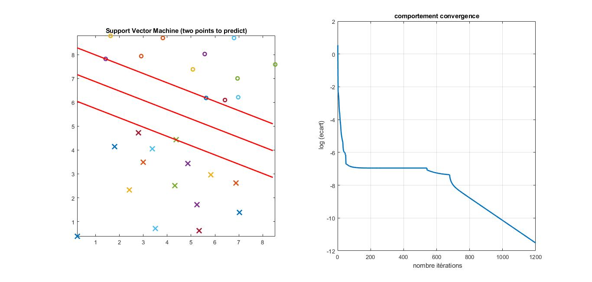

Afin d’évaluer la précision de notre classifieur, prenons un cas simple (cas de
2 points) et comparons avec la solution analytique.
Dans ce cas la solution analytique est la droite médiatrice du segment engendré
par les deux points à séparer, en voici une illustration : Figure 2

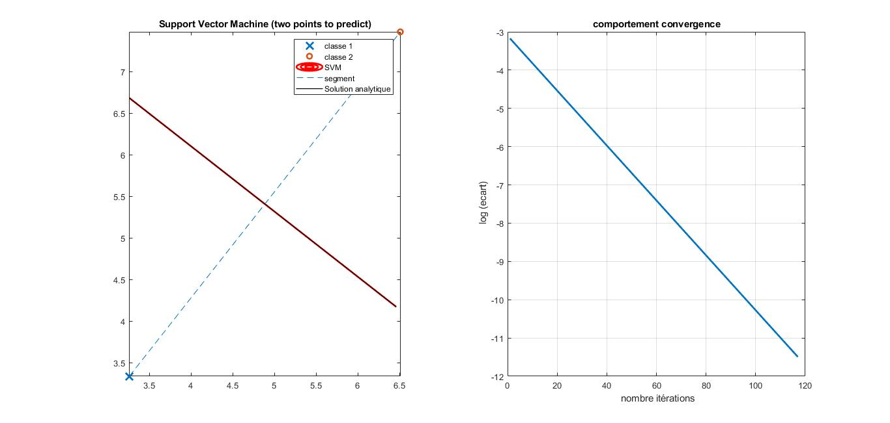

On voit que les deux droites séparatrices sont confondues ainsi notre classi-
fieur SVM est précis et promets de bon résultat dans des cas plus complexes.


La prochaine étape dans notre analyse est de réaliser uneétude numé-
riqueen évaluant l’influene des différents paramètres faisant l’objet d’un choix
aléatoire au début, à savoir le pas du gradient, le point de départ pour lesαet
le critère d’arrêt, ce qui est illustré dans les trois figures qui suivent : Figures
3 4 5

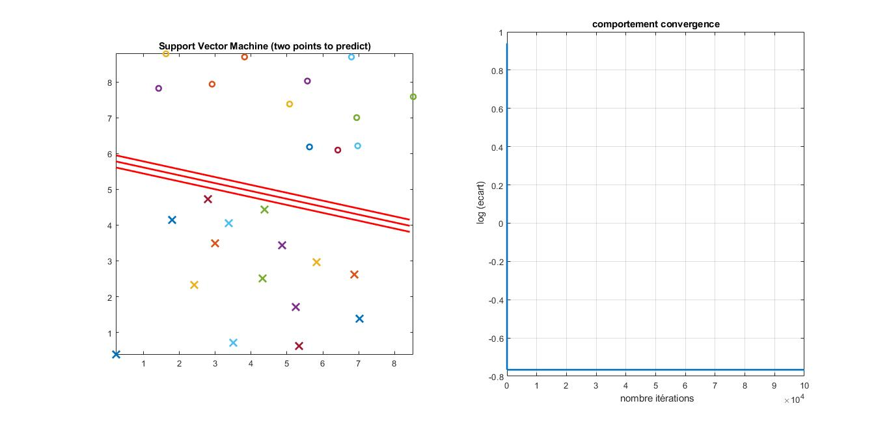

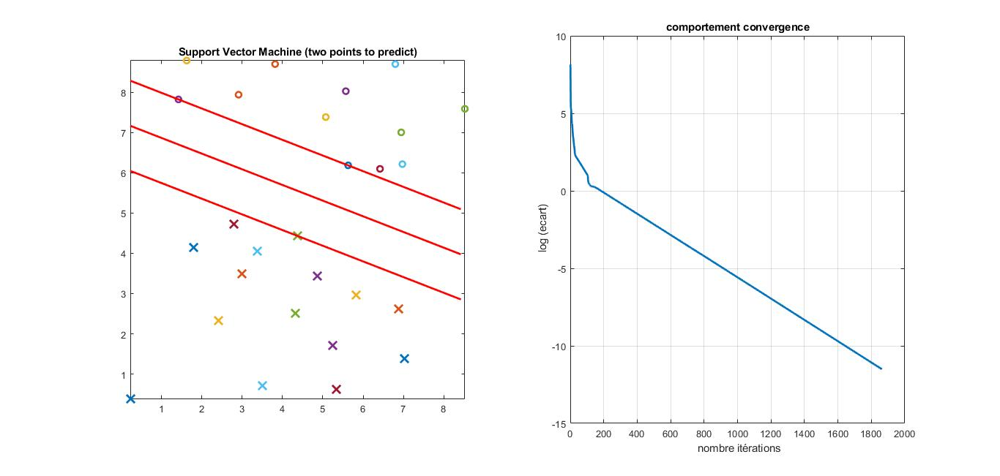


Pas du gradient :Pour comparer, on a pris un pas plus grand ( 10 −^2 ), et
la remarque faite c’est qu’à partir de la toute première itération onn’arrive plus
à descendre encore, on est bloqué sur les murs de la vallée à cause du pas très
grand qu’on fait. En conséquent on a obtenu une marge qui est beaucoup plus
petite que ce qui est attendu.
Point de départ :Si on prend un point de départ trop éloigné (1000),
l’influence est seulement sur la vitesse de convergence qui est un peu plus éle-
vée, mais on arrive quand même au résultat attendu, ainsi notre classifieur est
efficace.


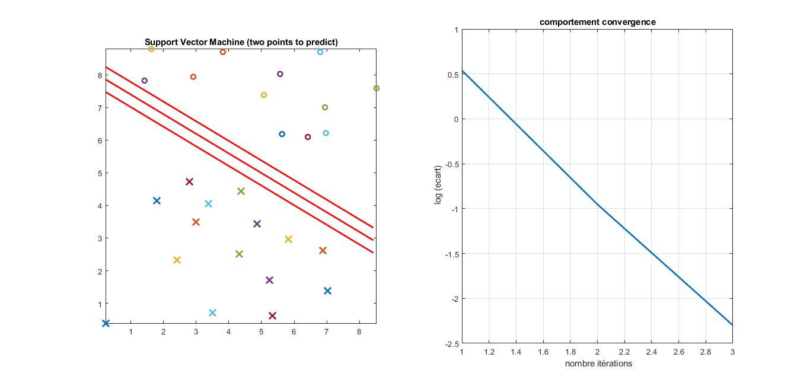


Critère d’arrêt :Quant au critère d’arrêt, si il est très élevé comme dans
ce cas ( 10 −^1 ) on n’atteint pas la précision demandée et nos marges sont encore
trop petites.
Maintenant on va utiliser le kernel gaussien pour juger de son importance, la
comparaison va se faire dans le cas d’un nuage de points difficilement séparable
sur son espace de départ et qui nécessite donc l’utilisation d’un kernel, en voici
les résultats : Figure 6

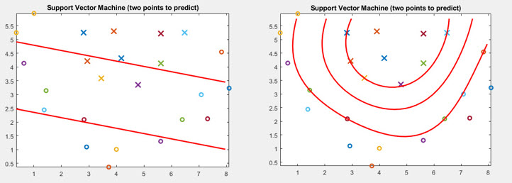

Il est clair que sans transformation gaussienne l’hyperplan retrouvé est com-
plètement à coté de la plaque, d’où l’importance de l’utilisation dukernel trick.
Une dernière partie qui reste est la vérification de l’importance de lamarge
souplesur un nuage de points qui comporte un ou plusieursoutliers, et la
différence est flagrante : Figure 7
On voit que l’hypersurface est bien meilleure dans le cas de l’utilisation d’une
marge souple, en jouant sur le paramètre C on pourrait peut-être l’améliorer
encore mais on se contentera de ces résultats assez satisfaisants pour le moment.


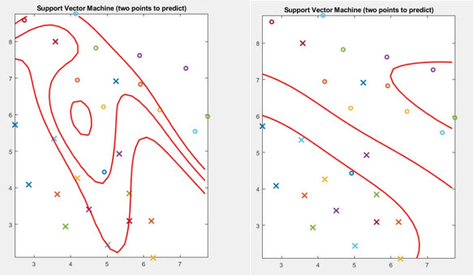

### 1.4 méthodes SVR et application sur le problème des an-

### tennes

Principe des méthodes SVR :L’objectif est de développer un outil de
régression, par rapport aux SVM : les yi remplacent les labels li.
On cherche l’hyperplan qui approche au mieux lesppoints, au sens où on
voudrait que cesppoints soient à l’intérieur d’une marge de taille 2 epsilon (voir
dessin), avec epsilon fixé.
La formulation du problème a été faite en détails pendant les séances de
TP. La méthode a été correctement implementée sur MATLAB (script joint au
rapport) pour des raisons de simplification on ne rentrera pas dans les détails
vu que c’est analogue aux SVM, et on passera directement à l’application et
l’interpretation sur l’exemple des Antennes.
A partir des données d’apprentissageantennes 2 dtrain.maton a généré la
surface f(x) correspondante representant les valeurs prises par notre modèle
regressif sur une grille remplissant l’espace, le résultat est le suivant : Figure 8

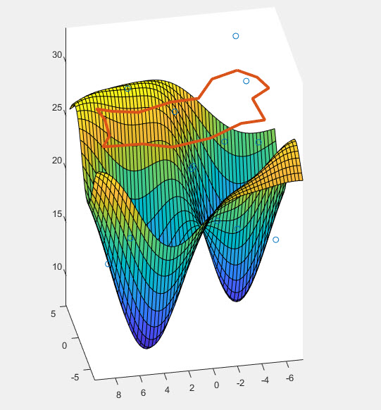

La surface correspond très bien à ce qui est attendu sur l’énoncé du TP.

Optimisation locale :Afin de déterminer le meilleur emplacement de la
nouvelle antenne, il ne faut de trouver un minimum de la surface trouvée, à
ce stade on va utilisé une méthode d’optimisation locale (l’optimisation globale
sera traitée ultérieurement).
La fonction MATLAB fminsearch est une fonction qui recherche un minimum
local avec une méthode de gradient descendant, et c’est ce qu’on va utilisée à
partir de plusieurs points de départ, en voila le script et le résultat : Figure 9

```
1 %Optimisation locale
2 p0 = [0,0]; %points de depart
3 p1 = [-2,2];
4 p2 = [-1,0.3];
5 fun = @(p)pred(p); %regarder prochain paragraphe pour la ...
fonction pred
6 [P,fval] = fminsearch(fun,p0); %Minima et valeur minimale
7 [P1,fval1] = fminsearch(fun,p1);
8 [P2,fval2] = fminsearch(fun,p2);
```

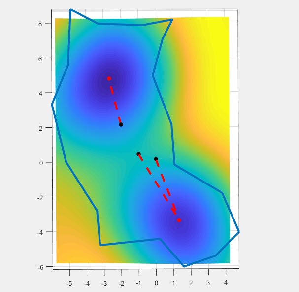

Notre surface contient deux minimas locaux, et selon le point de départ on
tombe sur l’un ou l’autre. Dans ce cas les valeurs de la fonction S sont assez
proches au fond des deux vallées 7. 3018 , 8. 4238 mais cela pourrait être bien pire
vu que notre optimisation n’est que locale.
Prédiction :La dernière étape dans ce cas d’application est la prédiction des
valeurs de notre fonction surface sur les données test fournies :antennes 2 d test.mat.
On a réalisé cela à l’aide d’une fonction pred.m:

```
1 function S = pred(C)
2 load Modele X Y alpha b
3 S = prodwr(X,alpha,C')+b;
4 end
```

On a ensuite appliqué cette fonction sur les données test et stocké les résul-
tats.
La cas 6D a été traité de la même manière.
Fichiers joints : Benechehab_Gueddari_Adref _test_2d.mat, Benechehab_Gueddari_Adref
_test_6d.mat, Contenant chacun une variable S_test avec les valeurs prédites.

## 2 Metamodeling (Xavier Bay)

We will work on the 2d Data first, the 6D case is analogue to the way we
are going to proceed in this paragraph.
1. The first step is loading the data :

```
1 #application
2 rm(list=ls())
3 load("antennes_2d_test.Rdata")
4 C_test <- C
5 load ("antennes_2d_train.Rdata")
```
2.Building the kriging model :
In order to decide which kernel to use, we have built a function that is
equivalent to the functionkmof the packageDiceKriging.
We implemented the leave-one-out validation method using a function cal-
ledtest, this function takes a value of θ andσand the kernel type and then
computes the Rmse (root mean squared error). A minimization loop was then
coded browsing a grid ofθvalues and a grid of σ values and the four kernel
types (Gaussian, Exponential, Matern 3/2, Matern 5/2).
Here is an extract of the said function :

```
1 library(ModelMetrics)
2 test <- function(kernel,theta,sigma,C,S) {
3 ngrid <- n.expl
4 xgrid <- C
5 pred = rep(0,ngrid)
6 %On enleve a chaque fois un element
7 for (i in 1:ngrid) {
8 %donnees d'apprentissage
9 X <- xgrid[-i,]
10 y <- S[-i]
11 if (kernel == "gauss"){
12 kXX <- kGauss(X,X,theta,sigma)
13 invkXX <- solve(kXX)
14 m <- function(x){
15 kxx <- kGauss(x,x,theta,sigma)
16 kxX <- kGauss(x,X,theta,sigma)
17 return(kxX%*%invkXX%*%y)
18 }
19 mu <- m(xgrid)
20 } else if (kernel == "exponentiel") {
21 ... % le reste des noyaux
22 }
23 pred[i] <- mu[i]
24 }
25 return(rmse(S,pred))
26 }
27 %The values of theta, sigma and kernel types
28 theta = matrix(seq(from=0.01, to=10, length=100),ncol=1)
29 sigma = matrix(seq(from=0.01, to=10, length=10),ncol=1)
30 kernel = c("gauss","exponentiel","matern3","matern5")
31
32 %The loop of optimisation
33 Rmse=
34 for (k in 1:length(kernel)) { %juste gauss et exp parce que %les ...
autres ne sont pas encore codes
35 for (j in 1:length(sigma)) {
36 for (i in 1:length(theta)) {
37 result = test(kernel = kernel[k], theta[i], sigma[j],C,S)
38 if (result≤Rmse){
39 Rmse = result
40 thetabest=theta[i]
41 sigmabest=sigma[j]
42 kernelbest=kernel[k]
43 }
44 }
45 }
46 }
```
The result of this function gives the following parameters :θ = 4. 5509 ,
σ= 3. 34 with kernel type Matern 3/2 and rmse = 1. 8459.
Now we are going to proceed using the DiceKriging package in order to
predict the S values for the test Data using the same kernel Type that we got
from the last paragraph : Matern 3/

```
1 install.packages("DiceKriging")
2 library(DiceKriging)
3 %Kriging model
4 Model <- km(formula=¬1,design = C, response = S, ...
covtype="matern3_2")
5 %Mean prediction
6 Result <- predict.km(object = Model, newdata = C_test, type = "SK")
7 S_test <- Result$mean
```
The confidence interval can be obtained from the objectResult, it contains
two arrays upper95 and lower95 corresponding to the confidence interval bounds.
3.measure the quality of the kriging model :
The following metrics summarize the efficiency of our model : it’s an analysis
of the standard residuals of the leave-one-out done by thekmfunction :


```
1 plot(Model)
```
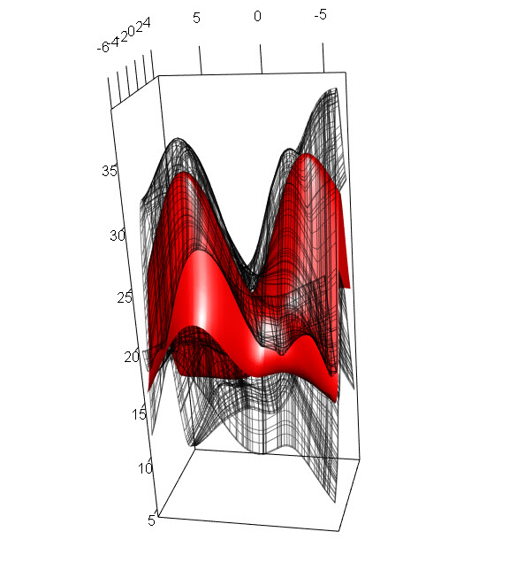

In the first plot, we can assume that the values obtained are around the line
of true values so the model has been precise during the leave-one-out validation.
We can also tell that the standardized residuals follow a normal distribution
from the qq-plot, hence we have a robust and accurate model.
4.make predictions at the testing locations : The predictions were made in
the previous question, for a better visualization we will make predictions at the
points of a uniform grid covering all the space of the Loire department, this is
done as following : Figure 11

```
1 #uniform
2 min1 <- -
3 max1 <- 5
4 min2 <- -6.
5 max2 <- 8.
6 n <- 100
7 X1 <- sort((max1-min1)*runif(n)+min1)
8 X2 <- sort((max2-min2)*runif(n)+min2)
9 X = matrix(nrow = n^2,ncol = 2)
10 k=
11 for (j in 1:n) {
12 for (i in 1:n){
13 k=k+
14 X[k,1] = X1[i]
15 X[k,2] = X2[j]
16 }
17 }
18 Result <- predict.km(object = Model, newdata = X, type = "SK")
19 #Prediction and confidence interval
20 mu <- Result$mean
21 up <- Result$upper
22 low <- Result$lower
23 #library(rgl)
24 open3d()
25 surface3d(X1,X2,mu,color = "red")
26 surface3d(X1,X2,up,color = "black", alpha = 0.5, lit = FALSE, ...
front = "lines", back = "lines")
27 surface3d(X1,X2,low,color = "black", alpha = 0.5, lit = FALSE, ...
front = "lines", back = "lines")
28 axes3d()
```


Which is conform to what we expect.

## 3 Design of Experiments (Mickaël Binois)

Goal : Propose four new designs to improve the current designs of experi-
ments (in 2D and 6D) for the subsequent tasks (e.g., optimization).

1. a.In order to identify the type of design of experiments used to gene-
rate antennes_2d_train.C, antennes_2d_test.C, we ploted them in a grid and
analysed the LHS property : Figures 12
For the 6D case we kept the same logic by plotting the first antenna’s longi-
tude to its latitude (for example x1 to x2) and the result is the same, they are all LHS designs.


1. b.To compare our designs, we created two new designs, a uniform one and
a regular one (factorial design) with the same number of points as our training
Data (20 points), here is what they look like : Figure 13


We then implemented the Maximin criterion and computed it for the three
designs to compare (training Data, uniform design, factorial design) :

```
1 > maximin <- function(X) {
2 + return(min(dist(X)))
3 + }
4 > print(c("maximin pour grille reguliere", maximin(reg)))
5 [1] "maximin pour grille reguliere" "2.75"
6 > print(c("maximin pour grille donnee", maximin(C)))
7 [1] "maximin pour grille donnee" "1.00704656850412"
8 > print(c("maximin pour grille uniforme", maximin(c(unif1,unif2))))
9 [1] "maximin pour grille uniforme" "0.00147295137867332"
```
Hence the best of the three designs is the factorial design, still our training
design is not that bad comparing to the uniform design.
The same thing for discrepancy criteria, the following function from DiceDesignpackage computes it for us :

```
1 > library("DiceDesign")
2 > print(c("discrepancy pour grille reguliere", ...
discrepancyCriteria(reg,type='L2')))
3 [1] "discrepancy pour grille reguliere"
4 $DisL
5 [1] 0.
6 > print(c("discrepancy pour grille ...
donnee",discrepancyCriteria(C,type='L2')))
7 [1] "discrepancy pour grille donnee"
8 $DisL
9 [1] 0.
10 > print(c("discrepancy pour grille uniforme", ...
discrepancyCriteria(c(unif1,unif2),type='L2')))
11 [1] "discrepancy pour grille uniforme"
12 $DisL
13 [1] 0.
```
The best value obtained belongs to our training Design of experiments, thus
we can qualify it as a uniform design.
Another way to measure the non-uniformity of our initial Design is by using
the rss2d function from the same package, this function compares the distribu-
tion of projected points to the uniform distribution in each direction. It gives us
an idea about the discrepancy of the design, let’s analyse the plots we got from
it : Figure 14

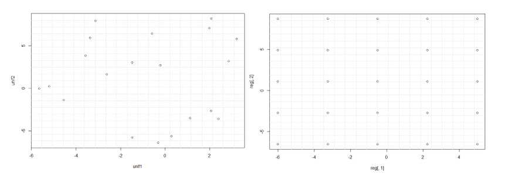

In the second plot, the statistic crosses the uniformity circle only in one
direction which is not very good in terms of the uniformity of the design.
To keep or reject the H 0 hypothesis (the design is uniform), we can look into
the worst radial scanning statistic which is the output of the rss2d function,
its a value is : 0.1462096, this value is to compare to the threshold value at
5% obtained under the uniform assumption (object$gof.test.stat = 0.12325),


this comparison confirms our assumptions about the rejection of the uniformity
hypothesis.
For the 6D case, the same analysis was performed and the results are almost
the same : for the maximin criteria the factorial design is the best (which is
completely logical), and for the discrepancy the training Data Design is the
winner.
2.Proposing new designs :The new designs will be computed based on
the design of experiments used to build our training Data. We will modify this
design following first the Maximin Criteria, a function calledmaximinSA_LHS.
in fact, this function allows us to keep replacing a point from the initial design
by another one chosen from a candidate list in a way to maximize the maximin
criteria. This maximization is realized based in a meta-heuristic algorithm (SA :
Simulated annealing).
The figure 15 shows the first design and the amelioration using the described
function, the value of the maximin criteria is consequently higher for this new
design :

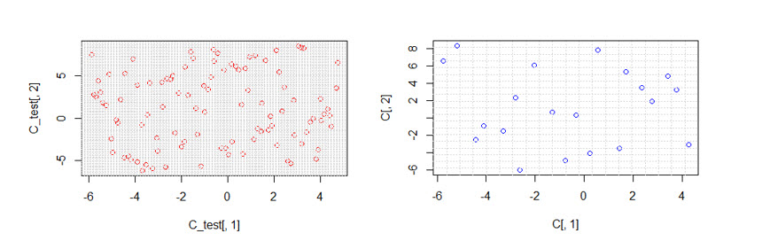

```
1 > print(c("maximin pour grille amelioree avec maximin critere", ...
maximin(NewC1)))
2 [1] "maximin pour grille amelioree avec maximin critere"
3 [2] "2.33495774473857"
4 %The value obtaind is close to the factorial design's maximin ...
criteria which means that it is high enough
```
For the Discrepancy criteria, we coded a function that takes a number of
points and for each iteration it chooses a point from a list of candidate points
following a uniform distribution, keeping each time the optimal point regarding
to the discrepancy criteria.


```
1 #Discrepancy
2 Discrepcrit <- function(nb_points,nb_candidates){
3 %Initializing the variables
4 X_final = matrix(nrow = nb_points,ncol = 2)
5 unif <- cbind((max1-min1)*runif(2)+min1,(max2-min2)*runif(2)+min2)
6 d <- discrepancyCriteria(unif,type='L2')
7 d <- d$DisL
8 X_final[1:2,] <- unif
9 for(i in 3:nb_points){
10 set.seed(i)
11 unif <- cbind((max1-min1)*runif(nb_candidates)+min1,
12 (max2-min2)*runif(nb_candidates)+min2)
13 k=
14 X_final[i,] <- unif[1,]
15 d <- discrepancyCriteria(X_final[1:i,],type='L2')
16 d <- d$DisL
17 mincrit <- d
18 for (j in 2:nb_candidates) {
19 X_final[i,] <- unif[j,]
20 d <- discrepancyCriteria(X_final[1:i,],type='L2')
21 d <- d$DisL
22 if (d < mincrit) {
23 mincrit <- d
24 k=j
25 }
26 }
27 X_final[i,] <- unif[k,]
28 }
29 return(X_final)
30 }
```
For a number of points equal to 20 with 5000 candidate points, the given
design with its corresponding metrics is as follows :


```
1 > print(c("maximin pour grille amelioree avec discrepance ...
critere", maximin(discrepdesign)))
2 [1] "maximin pour grille amelioree avec discrepance critere"
3 [2] "0.651624142187238"
4 > print(c("discrepancy pour grille amelioree avec discrepance ...
critere", discrepancyCriteria(discrepdesign,type='L2')))
5 [[1]]
6 [1] "discrepancy pour grille amelioree avec discrepance critere"
7 $DisL
8 [1] 0.
```
As expected, this design has the lowest discrepancy value recorded among
the previous designs, though its maximin criteria is still low.

3. New Designs based on the IMSE and maxVar criteria:
For the IMSE criteria, the function we used is the functionintegration_from the
packageKrigInv, this function creates a Design from a kriging model by selecting
the best of a number of Candidates based on multiple criteria, in our case it
is the IMSE criteria, the Design corresponding to it is the following with its
metrics (Maximin and discrepancy measurements) : Figure 17


```
1 > print(c("discrepancy pour grille generee avec le critere ...
IMSE", discrepancyCriteria(imsedesign,type='L2')))
2 [[1]]
3 [1] "discrepancy pour grille generee avec le critere IMSE"
4 $DisL
5 [1] 0.
6 > print(c("maximin pour grille generee avec le critere IMSE", ...
maximin(imsedesign)))
7 [1] "maximin pour grille generee avec le critere IMSE"
8 [2] "0.183778589637196"
```

This new Design have a good Maximin score (high) but its discrepancy is
high also which means that it is not sufficiently uniform (the same remark done
by observing the plot of the Design).
The next Design we are gonna create is based in the maxVar criteria, it is
shown in the course material as the G-optimality defined by :minXmax x∈D s^2 N(x)
with s^2 n(x) the predictive variance from kriging. We coded a function that takes
a number of points and for each iteration it chooses a point from a list of can-
didate points following a uniform distribution, keeping each time the optimal
point regarding to the maxVar criteria.

```
1 #MaxVar
2 MaxVar <- function(nb_points,nb_candidates,object_km){
3 %Initializing the variables
4 X_final = matrix(nrow = nb_points,ncol = 2)
5 unif <- cbind((max1-min1)*runif(1)+min1,(max2-min2)*runif(1)+min2)
6 Result <- predict.km(object = object_km, newdata = unif, type ...
= "SK")
7 sd <- Result$sd
8 mincrit <- sd[1]
9 X_final[1,] <- unif
10 %Loop that chooses the points
11 for(i in 2:nb_points){
12 set.seed(i)
13 %Choosing the candidate points
14 unif <- cbind((max1-min1)*runif(nb_candidates)+min1,
15 (max2-min2)*runif(nb_candidates)+min2)
16 Result <- predict.km(object = object_km, newdata = unif, ...
type = "SK")
17 sd <- Result$sd
18 k=
19 %Minimazing the MaxVar criteria on the candidate points
20 for (j in 1:nb_candidates) {
21 if (sd[j]≤mincrit) {
22 mincrit <- sd[j]
23 k=
24 break
25 }
26 }
27 if (k==1) {
28 X_final[i,] <- unif[j,]
29 } else {
30 %If none of the points improve the algorithm a random ...
point is added
31 X_final[i,] <- unif[1,]
32 }
33 }
34 return(X_final)
35 }
```
For a number of points equal to 20 with 500 candidate points, the given
design with its corresponding metrics is as follows :


```
1 > print(c("maximin pour grille generee avec le critere MaxVar", ...
maximin(maxvardesign)))
2 [1] "maximin pour grille generee avec le critere MaxVar"
3 [2] "0.209315082878951"
4 > print(c("discrepancy pour grille generee avec le critere ...
MaxVar", discrepancyCriteria(maxvardesign,type='L2')))
5 [[1]]
6 [1] "discrepancy pour grille generee avec le critere MaxVar"
7 $DisL
8 [1] 0.
```
This new Design have a low Maximin score Which is not very good, but
it is discrepancy value is acceptable(close to the value given for the uniform
distribution).
The 6d case is done with the same functions and is compared with the
same metrics and criterion, we did not include it here since we can not visualize
it for simplicity.


## 4 Global sensitivity analysis (Espéran Padonou)

In this part of the project we will focus on the sensitivity study to get an
idea of the importance of the input factors (parameters, input variables of the
model, etc.) and the interaction between them, our importance criterion will be
the rate of contribution of such variables to the variability of the output.
Several methods exist to assess the influence of input factors : FAST, SO-
BOL, MORRIS, etc. In this project we will apply the SOBOL and MORRISS
method on our data.
We have a database composed of :

- 2D ( train / test ) data :The points of surfaces covered by only two
    antennas, one of which is fixed
- 6D (train / test) data :The points of surfaces covered by three free
    antennas.
All the values covered by these antennas are in delimited by the interval
[LB,UB]with LB= (− 6 ,− 6 .5)and UB= (5, 8 .7)
The sensitivity study in our project is divided into two sections the first
will be in 2 dimensions and the second which is important for us will be in 6
dimensions.

### 4.1 Two dimensional case

In this first part using just two antennas, one of which is fixed, to assimilate
the SOBOL decomposition method, we will consider two variables X1 and X
uniformly removed over the interval [LB,UB] these two variables correspond to
the position of the free antenna.
We know that the decomposition of SOBOL is unique as follows :

S 0 +S 1 (X 1 ) +S 2 (X 2 ) +S 1 , 2 (X 1 ,X 2 )
S(X 1 ,X 2 )is approximated by a kriging mean function
The objective will be the simulation of S1 and S2 on [LB,UB] and compute
SOBOL indices then after applying MORRIS method on the same data and
comparing the results.
The following figures show the estimate of the conditional expectation of X
and X2 (the position of the free antenna) which is defined by :

```
E(S(X)|Xi)−S 0 , with S 0 =E(S(X))
```


Now is the time to calculate the sensitivity indices by the SOBOL method.
Indeed, the sensitivity indices are very synthetic measures of the model’s sensi-
tivity to factors, and they have a precise mathematical definition based on the
variance as follows :

V arE(S(X)|Xi)
V ar(S(X))
For the calculated we used thefast99()function of the sensitivity package.
The following figure shows the plot of SOBOL indices with their main effect
and the interaction of each with the other indices.

```
Figure20 – SOBOL indices for 2D
```

The remark that is obvious is that the interaction between the two variables
is quite important which is normal since they both form the position of the
free antenna, and they have a main effect which differs from 0 so we can not
eliminate a variable.
To be on the results which we obtained, we will apply the method of MORRIS
on the same data and will compare the results.
The principle of the Morris method is to estimate the sensitivity one para-
meter at a time (OAT), called the trajectory, and to repeat this evaluation at
several points in the parameter space.
Using themorris()function of package sensitivity we will have as outputs :

```
μi∗:The average of the r absolute values|∆i(h)|
σi: Thestandard deviation of the r values∆i(h)
With an interpretation as follows :
```
```
1 if mu_i*is large
2 X_i is influent;
3 end
4
5 if X_i has no interaction with other variables AND the ...
output is linear / X_i
6 segma_i = 0;
7 end
```
```
The plot below shows us the position ofX 1 andX 2 in the(σ,μ∗)
```
```
Figure21 – 2D Morris method plot
```

As we can see all the variables have a very largeμ∗value which shows their
importance and they have a fairly imposingσvalue which shows that their
effects include interaction between them, all these results reassure us those that
we got using the SOBOL method

### 4.2 The 6 dimensional case

This part which interests us the most, because we will study the influence of
the variables{Xi}i∈[1,6]which correspond to the position of the 3 antennas
which are all free with :

- (X 1 ,X 2 ): Represents the first antenna
- (X 3 ,X 4 ): Represents the second antenna
- (X 5 ,X 6 ): Represents the third antenna
All these variables are uniformly distributed over the interval[LB,UB]that
we defined previously.
The main objective of this part is to show that the SOBOL decomposition
ofS(X 1 ,X 2 ,X 3 ,X 4 ,X 5 ,X 6 )would have 6 non-null terms.
The approach will be the same as in 2D :
1. Generate our model which will approximate the function S with the Kri-
ging average (using thekm()function withcovtype= ‘matern 3 ′ 2 ) the
result of the meta-modeling part
2. SimulateSiwithi∈[LB,UB]
3. Calculate the SOBOL indices (using thefast99()function)
4. Apply the MORRIS method and compare the results
The following figures show the estimate of the conditional expectation of Xi
of each antenna which is defined by :

```
E(S(X)|Xi)−S 0 , WithS 0 =E(S(X))
```
```
For computations we choose to generate 10000 for eachXi
```
```
Figure22 – Projection on the variable for the 1st antenna
```

```
Figure23 – Projection on the variable for the 2nd antenna
```
```
Figure24 – Projection on the variable for the 3th antenna
```
As in 2D the SOBOL indices are calculated using thefast99()method, the
following plot shows the main effect of each variable and its interaction with the
other variables :


```
Figure25 – SOBOL indices on 6D
```
As we can see all the variables have a non-negligible main effect, although
the variableX 2 andX 6 have a close almost zero main effect but let’s not forget
that they have an important interaction with the other variables which appear
normal because all the antennas are free and we cannot eliminate the interaction
of these two variables with the others otherwise we will have results which are
not relevant (lack of precision).
Using the method of MORRIS to compare the results with those which we
obtained by using the decomposition of SOBOL, the following plot gives us an
idea about the distribution of the variablesXion the space(σ,μ∗)


```
Figure26 – MORRIS plot on 6D
```
We can see that the two variablesX 2 andX 6 do not have a very large total
effect due to their small value ofμ∗but we cannot neglect them because they
have a fairly significant interaction with the other variables due to their values
of sigma which is different of zero. This reassures the results that we obtained
by applying the SOBOL method.


## 5 Global optimization (Rodolphe Le Riche)

### 5.1 CMA-ES optimization of the kriging mean

Method using normal research :
We selected to use the algorithm of normal research after making some
changes that permits the optimizer to maximize the function rather than mini-
mizing it. We used it to perform the ES (1+1) algorithm.
We made also some changes in CMAES algorithm to use it as a maximiser.
( We changed y to -y)

```
Figure27 – Optimizing using ES 1-1
```
```
With the optimal solution : (x=1.424406 ,y=-3.990666) and fbest= 33.55673.
```

```
Figure28 – CMA-ES
```
With the optimal solution : (x=1.426178 ,y=-3.972225) and fbest = 33.55699
We can notice that both algorithms give approximately the same solutions.
Case of 6D :
We used a new function to calculate the mean of kriging :

```
Figure29 – fonction meanofGP6D
```

```
Figure30 – Code kriging 6D for ES(1+1) method
```
```
Figure31 – Code kriging 6D for CMAES method
```
With ES-(1+1) we obtained xbest = ( 2.318783, -3.736626, -2.551974, 3.175625
,-2.630278 ,3.948907) and : fbest=60.83426
With CMA-ES we obtained : xbest = (2.19264510, -4.01228413, -2.71227043,
5.40331650, -1.45919948, -0.068149047) and : fbest=57.15873
The values fbest that we have obtained in the two different methods are
quite close.

### 5.2 One EGO iteration

2D case :
xbest = (1.520824 -3.972241) fbest = 20.99994 Best mean of kriging =
33.56853
We notice in this case that the best mean of kriging is approximately equal
to the one obtained in the previous method.
We notice that after multiple executions the value doesn’t change. Which
means that one iteration is not sufficient to get out of the optima.
6D case : xbest = (-2.199832 2.553966 -2.984977 2.334963 1.918567 -3.252413)
best expected improvement = 52.91965 fbest = 56.6406
We notice in this case that fbest we have got is close to the one obtained in
the first part.
Considering the two cases, we noticed that the CMA-ES optimization of
the kriging mean, is worse than One EGO iteration. In fact, CMA-ES is an
algorithm based on the optimization of the kriging mean (which is cheap), so its
performance depends strongly on the quality of the predictions of our kriging


model. So it is not better than the EGO algorithm since this last one explores
new regions and provides the real values instead of predicted ones.
If we had 100 iterations of the EGO algorithm, we would have more explored
points which will improve our chances to get closer to the global optima.


